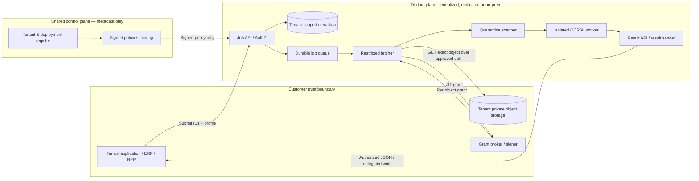
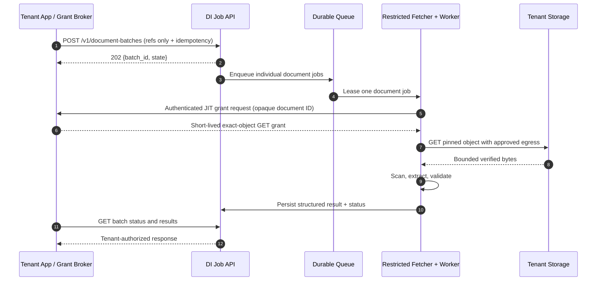

# Tenant-Owned Storage → Document Intelligence

**Enterprise Architecture Blueprint · BYOS / Delegated Read / Hybrid Data Plane**  
**Version:** 1.0.0 · **Status:** Proposed implementation baseline · **Date:** 8 October 2026

> **Architectural decision:** A tenant retains authoritative ownership of the source document in private object storage. Document Intelligence (DI) accesses only explicitly authorized objects through short-lived, read-only, delegated grants. For asynchronous batch jobs, access is issued just in time. The result is returned through a tenant-authorized API or written to a tenant-supplied result destination. The control plane must not possess broad access to tenant source storage.

## 0. Purpose and agent usage

This blueprint is normative for AI-assisted implementation of the Document Intelligence subsystem. Its purpose is to constrain architectural decisions independently of language, framework, OCR engine, LLM, or storage vendor.

**Before coding:** (1) inspect existing architecture and contracts; (2) identify which component owns the change; (3) preserve trust boundaries, states, and invariants defined here; (4) implement the smallest compatible change; (5) add negative tests for authorization, network egress, and credential leakage; (6) report deviations via Architecture Decision Record (ADR), never silently reinterpret a MUST.

**Normative vocabulary:** MUST / MUST NOT indicate production requirements; SHOULD / SHOULD NOT indicate strong recommendations with documented exceptions; MAY indicates optional extensions. Sample JSON, TTL values, SQL, and endpoint names in this document are **proposed reference contracts**, not evidence of implemented services.

### 0.1 Scope

In scope: tenant-owned storage, federated processing, batch manifests, just-in-time (JIT) grants, delegated output, orchestration, authentication and authorization, resource isolation, SSRF protections, threat model, operational security, API contracts, data model, tests, and rollout.

Out of scope: particular programming language; customer-specific RFP payment rules; claims of guaranteed OCR accuracy; specific vendors or model versions; billing and UI implementation beyond integration requirements.

### 0.2 Key distinctions

- **Storage ownership ≠ data residency:** centralized DI workers download document bytes outside tenant infrastructure. On-premise/local data plane is mandatory when source bytes must never leave customer boundary.
- **Presigned URL ≠ single-use token:** a URL can often be reused before expiry. Actual single-use needs a consuming gateway enforcing atomic redemption, or a comparable verified mechanism.
- **Read-only ≠ risk-free:** the delegated URL is a bearer secret and an arbitrary URL fetch can enable SSRF.
- **OCR confidence ≠ business validity:** extraction evidence and deterministic validation remain separate.
- **Temporary processing ≠ zero persistence:** encrypted buffers, transient scratch storage, logs, retries, and backup behavior must be explicitly specified and tested.

## 1. Deployment and ownership model

| Deployment | Control plane | Data plane | Source object | Permitted document movement |
|---|---|---|---|---|
| `centralized` | Provider shared | Provider shared with tenant isolation | Tenant cloud object storage | Tenant → DI provider processing region when allowed by policy |
| `dedicated` | Provider shared | Per-tenant dedicated workers, secrets, queue, and storage | Tenant cloud / private storage | Tenant → dedicated DI environment only |
| `on_premise` | Provider shared or offline config | Customer-network runtime and local worker | Customer storage | Remains inside customer-approved network boundary |
| `air_gapped` | Offline signed configuration | Customer isolated runtime | Customer storage | No Internet/cloud traffic |

**Control plane owns:** deployment registration, capability registry, signed policy distribution, model catalog, license and non-sensitive metering. **Data plane owns:** object authorization at job submission, ingest, quarantine, job state, worker execution, sensitive result storage, retention, and local audit. **Tenant owns:** original document, generation and revocation of access grants, retention at source, destination for results, and consent for cross-boundary movement.

Control plane MUST NOT request source bytes, unrestricted storage keys, document field values, raw prompts, or arbitrary commands from local agents. Telemetry MUST be allowlisted, sanitized, and disableable under appropriate policy.

## 2. Logical component boundaries



A diagram does not supersede network segmentation: the restricted fetcher and AI worker SHOULD be distinct runtime security principals. Workers MUST NOT have direct blanket access to tenant endpoints or secrets.

## 3. End-to-end protocols

### 3.1 Single document

1. Tenant application authenticates as registered tenant/workload using OAuth 2.0 Client Credentials or an equivalent managed workload identity; user consent/permissions (when relevant) are verified server-side.
2. Tenant submits **document reference** (`document_id`, `object_id`, immutable `version_id`/generation or expected content digest), extraction profile, processing policy reference, and idempotency key. Tenant ID is derived from authenticated context; never trusted from request body.
3. API verifies tenant ownership, approved deployment region, processor capability, budgets/quotas, and job authorization; returns `202 Accepted` with `job_id`.
4. Worker receives a job containing **only opaque references**. Immediately before download, grant broker issues a short-lived exact-object read grant, bound to known storage origin. Control/queue databases MUST NOT store raw Signed URLs.
5. Restricted fetcher validates the registered origin, resolves DNS under egress controls, enforces HTTPS and no redirects by default, downloads bounded bytes and verifies object version/checksum and content signature. Revocation/expiry errors trigger bounded grant refresh, not broad credentials.
6. File is quarantined, malware/scanning/type-checking passes, then parser/OCR runs in a restricted sandbox. AI prompt input is untrusted data and cannot override system actions.
7. DI stores structured result in tenant-scoped encrypted result storage; API returns status/result or sends result to a tenant-issued exact-object PUT destination after explicit authorization.
8. Sensitive temporary bytes and ephemeral grants are destroyed according to lifecycle policy; an immutable/auditable event trail records metadata, not secrets or document content.

### 3.2 Batch — default JIT access

A batch submission is a manifest of document references **without presigned URLs**. Manifest MUST enforce maximum document count, aggregate size, allowed MIME types, and per-job limits. Jobs are independently retryable; one failed document MUST NOT silently fail unrelated jobs.



Grant broker MUST authenticate the requesting deployment and job; authorize its own document reference; never accept an arbitrary object ID supplied by a worker without checking the job binding. JIT grant flows MAY use an API broker rather than a worker→tenant direct request. A cloud control plane should not be the delivery path for sensitive grants in on-premise deployments.

### 3.3 Grant lifetime and expiry

- Initial default target TTL: **300 seconds**, configurable per provider and document characteristics; production sizing MUST be based on time to initiate transfer, retry strategy and network conditions.
- URL expiration may be evaluated **when a request starts**; download need not stop exactly at expiry. Treat TTL as limiting request initiation, not read duration.
- A failed/expired fetch MUST NOT reuse the same URL indefinitely. Request fresh grant with the same immutable document identity after a bounded retry and backoff.
- A `403` is **not** automatically refreshable: distinguish `expired_grant`, `revoked`, `object_missing`, `policy_denied`, and `provider_error` where the provider allows evidence.
- Tenant revocation after download cannot erase bytes already received. Promise revocation of **future reads**, plus stop/cancel and cleanup semantics for active jobs; do not promise instantaneous erasure.

## 4. Proposed HTTP API contract

API base path: `/v1`. Authentication: service-to-service OAuth2 bearer access token audience-bound for DI; sensitive network edges MAY require mTLS and certificate-bound tokens. Resource IDs MUST be opaque and authorized server-side.

| Method | Endpoint | Purpose | Principal |
|---|---|---|---|
| `POST` | `/v1/document-jobs` | Submit one object reference | Tenant service |
| `POST` | `/v1/document-batches` | Submit references batch | Tenant service |
| `GET` | `/v1/document-jobs/{job_id}` | State + summary | Authorized tenant |
| `GET` | `/v1/document-jobs/{job_id}/result` | Structured extraction | Authorized tenant |
| `GET` | `/v1/document-batches/{batch_id}` | Batch status & counts | Authorized tenant |
| `POST` | `/v1/document-jobs/{job_id}/cancel` | Request cancellation | Authorized tenant |
| `POST` | `/v1/grants/{grant_request_id}/issue` | Tenant grant broker issues JIT grant | Authenticated trusted broker |
| `POST` | `/v1/deployments/{id}/heartbeat` | Sanitized state & versions | Registered site agent |

Exact grant-broker endpoints may be inverted (DI callbacks into tenant). The design MUST specify how grants travel **without** appearing in normal job queues, ordinary application logs, distributed tracing baggage, or control-plane telemetry.

**Example job request:**

```http
POST /v1/document-jobs HTTP/1.1
Authorization: Bearer <TENANT_WORKLOAD_TOKEN>
Idempotency-Key: <UUID>
Content-Type: application/json
```

```json
{
  "document": {
    "document_id": "doc_8c02",
    "storage_connection_id": "storage_customer_a",
    "object_id": "obj_invoice_001",
    "version_id": "immutable-version-42",
    "sha256": "<64-hex-digit-digest>",
    "content_length": 1094832
  },
  "processing": {
    "profile": "invoice.standard.v1",
    "deployment_preference": "policy_selected",
    "result_delivery": "api_pull"
  }
}
```

`storage_connection_id` MUST map to a pre-registered and approved storage endpoint. `object_id` is an opaque reference for the tenant grant broker; DI MUST NOT treat it as a network URL or concatenation path. SHA-256 digest is optional where a trustworthy immutable provider version identifier suffices, but integrity verification is REQUIRED using provider-supported evidence.

**Accepted response:**

```json
{
  "job_id": "job_01J00001",
  "status": "queued",
  "status_url": "/v1/document-jobs/job_01J00001"
}
```

**Example batch request (references only):**

```json
{
  "profile": "rfp.supporting_documents.v1",
  "documents": [
    {"document_id":"doc_101","storage_connection_id":"customer_a","object_id":"obj_101","version_id":"v1"},
    {"document_id":"doc_102","storage_connection_id":"customer_a","object_id":"obj_102","version_id":"v3"}
  ],
  "result_delivery":"api_pull"
}
```

**Sensitive JIT grant response (broker to trusted fetcher only):**

```json
{
  "grant_request_id": "gr_01",
  "job_id": "job_01J00001",
  "operation": "GET",
  "url": "https://registered-storage.example/path?REDACTED",
  "expires_at": "2026-10-08T16:05:00Z",
  "headers": {},
  "expected_object_version": "immutable-version-42"
}
```

Never copy a real grant response to audit logs or support tickets. `headers` can contain bearer credentials in some provider implementations and MUST be secret-redacted.

**Example result:**

```json
{
  "schema_version":"1.0.0",
  "job_id":"job_01J00001",
  "status":"completed",
  "document_type":"invoice",
  "fields": {
    "invoice_number": {
      "value":"INV-2026-001",
      "data_type":"string",
      "confidence":0.98,
      "evidence":[{"page":1,"bounding_box":[0.15,0.12,0.41,0.17],"coordinate_system":"relative"}]
    }
  },
  "validation":{"status":"requires_review","issues":[{"code":"PAYMENT_ACCOUNT_UNVERIFIED"}]},
  "provenance":{"engine_version":"1.0.0","model_id":"invoice-extractor","model_version":"v1"}
}
```

Missing fields MUST be explicit (e.g. `value: null`, `status: not_found`), never hallucinated. `confidence` is not equivalent to verified business truth. The RFP system, not OCR, owns account validation against authoritative vendor master data.

**Error envelope:** `application/problem+json` (RFC 9457) with stable machine codes (e.g. `TENANT_ACCESS_DENIED`, `SOURCE_GRANT_EXPIRED`, `SOURCE_CHECKSUM_MISMATCH`, `SOURCE_UNREACHABLE`, `MALWARE_DETECTED`, `PROCESSING_TIMEOUT`, `POLICY_VIOLATION`). Never echo URLs, tokens, account numbers, source text, or storage internals in public errors.

## 5. State machines and queue guarantees

Document states: `created → queued → awaiting_grant → fetching → quarantined → scanning → processing → completed | review_required | failed | cancelled`. Conditional paths: `awaiting_grant/fetching → retry_pending → queued`, plus terminal expiration/cleanup. `review_required → completed` only after authorized review. `rejected` is terminal for malicious or prohibited files. Terminal states MUST NOT regress.

Batch states are computed from child jobs: `queued`, `running`, `completed`, `completed_with_errors`, `failed`, `cancelled`. Partial failures are visible; completed counts MUST be transactional/derived reliably.

- Submission MUST support idempotency per tenant and operation with a stored request fingerprint and defined expiration window. Same key + different payload = `409 Conflict`.
- Use an outbox or equivalent transactionally coupled enqueue strategy; avoid DB-commit-success / queue-publish-failure loss.
- Queue delivery MAY be at-least-once. Every handler MUST be idempotent, and worker leases/visibility timeouts must tolerate duplicates.
- Use bounded exponential backoff + jitter, capped attempts, dead-letter queue, per-tenant fair scheduling and quotas.
- Cancellation means best-effort stop, no new reads, and cleanup; it cannot undo an already transmitted or completed read.
- Results MUST be associated with tenant, document, immutable source identity, profile, model manifest and versioned output schema.

## 6. Data model — logical baseline

| Entity | Key fields | Required invariant |
|---|---|---|
| `tenants` | `tenant_id`, `status` | Tenant identity immutable and server-resolved |
| `deployments` | `deployment_id`, `tenant_id`, `mode`, `region`, `policy_version` | Data location authorized |
| `storage_connections` | `id`, `tenant_id`, `provider`, `origin_id`, `allowed_modes` | Allowlisted endpoint, no general secret in app DB |
| `documents` | `id`, `tenant_id`, `external_ref`, `version_id`, `digest`, `size` | Immutable source version per job |
| `document_jobs` | `job_id`, `tenant_id`, `document_id`, `state`, `attempt`, `profile_version`, `deployment_id`, `idempotency_key` | Tenant FK enforced; legal state transitions only |
| `batches` | `batch_id`, `tenant_id`, `profile`, `state` | All children belong to batch tenant |
| `batch_items` | `batch_id`, `job_id`, `tenant_id` | No cross-tenant mixed jobs |
| `grant_requests` | `id`, `job_id`, `expires_at`, `status`, `issued_at` | Reference only, no bearer URL in ordinary DB |
| `results` | `job_id`, `tenant_id`, `schema_version`, `result_location`, `retention_until` | Tenant-only access |
| `audit_events` | `actor_id`, `tenant_id`, `resource_id`, `action`, `outcome`, `trace_id`, `timestamp` | Append-only/logical tamper-evidence; sanitized fields |
| `policy_versions` | `id`, `tenant_id`, `deployment_id`, `signature`, `effective_at` | Signed; rollback controlled |

Database queries MUST scope by authenticated tenant in addition to database-level isolation such as PostgreSQL RLS, dedicated schemas or dedicated DBs. RLS is defense-in-depth, not a substitute for API authorization. Secrets MUST be stored using a secrets manager/KMS with tightly scoped access, not inside job payloads, log fields or plaintext columns.

## 7. Security controls (normative)

### 7.1 Identity and grant authority

- `SEC-001` Every request MUST be authenticated; tenant context MUST be derived from verified identity and workload registration.
- `SEC-002` Every object, job, batch, result and deployment operation MUST re-check tenant authorization (BOLA prevention).
- `SEC-003` DI MUST NOT request or retain cloud root credentials, long-lived account keys, or broad bucket permissions as standard integration.
- `SEC-004` A read grant MUST be scoped to exact object/version and operation, with explicit expiry; batch grants SHOULD be per-object JIT.
- `SEC-005` The grant broker MUST bind `(tenant, deployment, job, object, version, operation)` and authenticate requesting workloads.
- `SEC-006` A Signed URL MUST be treated as reusable bearer credential unless a separate verified single-use gateway consumes it atomically.
- `SEC-007` Token, Signed URL, SAS query string, secret headers and raw document contents MUST be redacted from logs, metrics, traces, URLs in error reports, and customer support exports.

### 7.2 SSRF / egress / network access

- `NET-001` Arbitrary caller-supplied URLs MUST NOT be fetched. Store a canonical provider endpoint pre-approved during `storage_connection` enrollment; resolve opaque references through a trusted provider adapter/grant broker.
- `NET-002` Fetcher MUST enforce HTTPS, approved host/port/provider, no userinfo and redirects disabled by default. If redirects are indispensable, revalidate each hop under a provider-specific policy.
- `NET-003` Egress MUST enforce a firewall/proxy deny-by-default policy and deny link-local, loopback, private, metadata service and otherwise disallowed targets, except explicitly registered private endpoints reachable through a dedicated secured channel.
- `NET-004` Validate DNS resolution and actual connection destination; mitigate DNS rebinding and IPv4/IPv6 representation bypasses; application validation alone MUST NOT be the sole barrier.
- `NET-005` Bound download bytes, connection timeout, total duration, decompressed size, redirects, retries, parsing time, CPU/RAM and concurrent jobs.

### 7.3 Untrusted content and AI

- `FILE-001` Files MUST be quarantined until type, magic signature, extension, safe limits, and malware policy pass.
- `FILE-002` Parser/OCR workers MUST use least privilege, unprivileged process identity, limited filesystem, and restricted egress; high-assurance tenants SHOULD use stronger VM/microVM isolation.
- `AI-001` Document text, OCR output and embedded links are untrusted data; model instructions MUST NOT be derived from document content as privileged commands.
- `AI-002` Inference/LLM egress MUST follow tenant policy; no external AI provider for local-only deployments unless expressly approved.
- `AI-003` Model output MUST pass schema validation; uncertain or low-evidence business-critical fields MUST be marked for human review.

### 7.4 Storage, residency, encryption and privacy

- `DATA-001` Source-of-truth object remains tenant-owned; DI ephemeral encrypted copy only where the approved data-plane policy permits.
- `DATA-002` DI MUST enforce region and data-residency policy before scheduling and at worker execution; no silent cloud fallback from local mode.
- `DATA-003` Use TLS in transit, KMS or equivalent encryption at rest for persistent data and encrypted temporary scratch where materialized.
- `DATA-004` Temporary bytes MUST be removed after completion/cancellation and according to bounded cleanup jobs after crash; define snapshots, swap, backup, logs and diagnostic artifacts explicitly.
- `DATA-005` Original source deletion is tenant responsibility; DI deletion covers DI-derived files/results/caches under contracted retention. A deletion receipt MUST NOT promise removal from tenant systems.
- `DATA-006` No customer document content used for model training by default. Subprocessors and retention require contract and explicit policy.

### 7.5 Artifacts and operations

- `OPS-001` Deployment configs and runtime artifacts MUST be signed, versioned and verified before activation; no arbitrary remote shell execution from control plane.
- `OPS-002` On-premise runtime SHOULD operate under last-known valid signed policy during temporary control-plane outage; expiration and revocation decisions MUST fail closed where trust cannot be established.
- `OPS-003` Each deployment MUST have backups, key recovery policy, auditable access, health checks, runbooks and rollback test.

## 8. Output delivery patterns

**Default `api_pull`:** DI stores result in tenant-scoped encrypted storage for an explicit TTL and authorizes each `GET /result` request. This mode is simple, but the result temporarily resides in DI infrastructure.

**Optional `signed_result_push`:** tenant issues exact-object `PUT` destination grant only after DI announces result readiness; sender verifies allowed destination and write conditions. To prevent accidental overwrite, use unique key + provider-specific conditional write or object version checks. Tenant MUST verify output digest/schema before acceptance. Never reuse a source read grant for result write.

**On-premise preferred:** both extraction and result storage local. Webhook MAY notify completion but MUST carry no sensitive document contents; signed webhook with replay protection and reliable retries.

## 9. Storage compatibility adapter contract

A provider adapter exposes: `describeCapability`, `validateRegisteredOrigin`, `requestReadGrant`, `fetchVersionedObject`, `verifyObjectIntegrity`, `requestResultWriteGrant`, `writeResult`, `normalizeProviderError`. All receive an immutable job authorization context.

| Provider | Intended integration | Special consideration |
|---|---|---|
| Amazon S3 | SigV4 presigned GET/PUT or workload-role access | Signed URL reusable until expiry; object versioning and bucket policy conditions must be configured |
| Azure Blob | Prefer user delegation SAS, or managed workload identity when possible | Delegation/SAS scope, revocation semantics and permissions depend on type |
| Google Cloud Storage | V4 signed URLs or workload identity where practical | Region, endpoint, generation preconditions and signature semantics |
| MinIO / S3-compatible | S3-compatible presigning | Verify actual provider behavior for versioning and signature support; do not assume exact AWS equivalence |
| Local gateway | Brokered one-time token with atomic redemption | Required for genuine single-use if provider URL is reusable |

Provider-specific safeguards MUST be tested against each supported provider implementation. A capability registry MUST refuse unsafe combinations rather than silently downgrading security.

## 10. Threat model snapshot

| Threat | Exploit route | Mandatory defense | Validation |
|---|---|---|---|
| Cross-tenant data leakage | Guess `job_id` or tamper `tenant_id` | Verified tenant context + object AuthZ + DB isolation | Attempt cross-tenant GET, write, batch mix |
| SSRF | Supply private or metadata URL | Registered endpoints + restricted network egress + DNS/IP enforcement | Localhost, metadata, private IPv4/IPv6, rebinding |
| Signed URL disclosure | Trace or error logs | Secret stripping at ingress and egress | Scan structured logs and error payloads |
| Broad credential disclosure | Storage key in manifest | Reject primary/bucket-wide credentials | Negative contract tests |
| Object substitution | Modify object during queue delay | Immutable version/generation or verified digest | Change bytes/version between grant and fetch |
| ZIP/PDF bomb | Decompression or parser abuse | Byte, ratio, page, CPU, RAM, timeout limits | Malicious fixtures |
| Prompt injection | Malicious text commands | Untrusted-document boundary, no privileged model tools | Adversarial OCR text fixture |
| Unwanted cross-region transfer | Wrong deployment scheduling | Residency enforcement at API and worker | Policy denied region test |
| Agent compromise | Remote command/update | Signed artifacts/config + no arbitrary remote shell | Tampered config/release tests |
| Repeated grant consumption | Reuse URL before TTL | No single-use claim; gateway redemption if required | Fetch twice before expiry |

## 11. Observability and SLO baseline

All logs MUST use sanitized `trace_id`, `tenant_id`, `deployment_id`, `job_id`, `phase`, `duration_ms`, `outcome`, and canonical error code. Source object names/path, raw extraction values, secret URLs and bearer tokens are sensitive and MUST NOT enter high-cardinality metrics or traces.

Candidate metrics: accepted jobs, per-stage latency, queue age, fetch failure breakdown, grant refresh count, scan reject rate, OCR timeout, review-required rate, partial-batch completion, tenant throttling, cleanup backlog, local-agent version skew. SLOs for latency/availability MUST be negotiated by deployment class and tested with representative document sizes.

## 12. Minimum acceptance criteria

- `AC-01` AuthZ: tenant A cannot submit/read/cancel tenant B resources (including guessing IDs).
- `AC-02` Network: fetcher blocks localhost, cloud metadata service, private IP, IPv6 bypass, malicious redirect and DNS rebinding unless specifically registered private endpoint policy permits it.
- `AC-03` Credentials: raw Signed URL, SAS/token and secret headers absent from DB job payload, queue payload, ordinary logs, traces and error responses.
- `AC-04` Grant: exact-object read only; expiry and renewal work; stale or revoked grant fails safely; two uses of a native Signed URL are **not claimed** to be impossible.
- `AC-05` Integrity: wrong version and digest mismatch cause controlled failure and no extract result.
- `AC-06` Batch: 1 invalid document does not hide results of other documents; counts, pagination and retry status remain accurate.
- `AC-07` Reliability: duplicate submission with same key does not duplicate business job; different payload with same key conflicts; crashed worker is retried with lease semantics.
- `AC-08` Residency: local-only deployment emits no raw content to cloud/control plane, including metrics, logs or AI-provider requests.
- `AC-09` Sandbox: malicious and resource-exhausting file fixtures cannot access host secrets or unauthorized network.
- `AC-10` Results: missing fields not fabricated; structured output includes provenance, evidence and version; human-review cases marked explicitly.
- `AC-11` Cleanup: temp files expire after crash, cancellation and retry; deletion semantics consistent with snapshots and backup policies.
- `AC-12` Update: tampered model artifact or signed policy is rejected; rollback tested against schema compatibility.

## 13. Delivery roadmap

**Phase 1 — Contracts and secure single-document path:** auth/tenant model, storage origin enrollment, job states, single document grant broker, isolated fetcher, bounded scanner and mocked extractor, structured result API, AuthZ/SSRF tests.

**Phase 2 — Batch and reliability:** manifest, JIT grants, outbox, leases, per-file retries, quota, idempotency, audit, results pagination and retention workers.

**Phase 3 — Hybrid and dedicated:** deployment registry, signed policy, local agent, local processing and local result retention, regional routing, dedicated workers/queues, offline behavior.

**Phase 4 — Production hardening:** provider compatibility suite, SIEM/OpenTelemetry sanitization, threat modeling, penetration testing, backup/recovery, signed builds, SBOM and customer deployment kits.

### Definition of Done for any module

1. Interface/schema documented and versioned; error semantics defined.
2. Server-side authentication, authorization, tenant isolation and policy check tested.
3. No secrets in source, database job, queue or logs; threat negative tests added.
4. Failure/retry/cancellation paths tested; state transitions atomic/idempotent.
5. Resource/time/network limits explicitly enforced.
6. No unrelated code change; build, tests, and diff reviewed; limitations disclosed.

## 14. AI coding guardrails

**Do:** inspect the repo and previous ADRs; use provider abstractions; validate object ownership on every access; enforce network egress outside application code; separate extraction from business validation; explicitly model uncertain outputs; test adversarial input; keep code and architecture language-neutral where possible.

**Do not:** accept tenant IDs from JSON as authority; retrieve arbitrary caller URLs; store presigned URLs in queue payloads; grant blanket bucket access; treat native signed URLs as one-time; process unscanned documents; let model text execute tools; return sensitive data in webhook/logs; silently switch local jobs to provider cloud; add tenant-specific `if` branches in core for configurable business policies.

For implementation deviations, create an ADR identifying: decision, context, alternatives, trust-boundary changes, new risks, tests, rollback, and owner approval. Never implement a critical exception silently.

## 15. Open architecture decisions (not to be assumed)

| ADR ID | Question | Default until decided |
|---|---|---|
| ADR-001 | Storage providers required in initial release? | One provider adapter plus contract tests; no unverified universal compatibility claim |
| ADR-002 | Which OAuth2 identity provider? | Standards-based workload OAuth2; no vendor lock-in |
| ADR-003 | Which regional boundaries and residency tiers? | Fail closed when region unknown |
| ADR-004 | Max document size/pages and batch size? | Explicit deployment-configured conservative limits |
| ADR-005 | Result sensitivity and retention period? | Minimize retention; policy + contract required |
| ADR-006 | Are true single-use grants mandated? | No; default scoped short-lived grants, optional gateway |
| ADR-007 | External AI permitted? | Disabled unless explicit tenant/data policy allows |
| ADR-008 | Dedicated tenant network model? | Separate worker, service principal, queue, secrets, storage per tenant |
| ADR-009 | On-prem agent inbound reachability? | Outbound-only control channel; broker via registered safe channel |
| ADR-010 | How are signed URLs held transiently? | Worker-only secret memory/short-lived secret vault, never durable job payload |

## 16. Reference standards and documentation

- AWS S3, presigned URLs and replay/expiry behavior: https://docs.aws.amazon.com/AmazonS3/latest/userguide/using-presigned-url.html
- Azure Storage, user delegation SAS and best practices: https://learn.microsoft.com/en-us/azure/storage/common/storage-sas-overview
- OWASP SSRF Prevention Cheat Sheet: https://cheatsheetseries.owasp.org/cheatsheets/Server_Side_Request_Forgery_Prevention_Cheat_Sheet.html
- OWASP File Upload Cheat Sheet: https://cheatsheetseries.owasp.org/cheatsheets/File_Upload_Cheat_Sheet.html
- OWASP API Security Top 10: https://owasp.org/API-Security/editions/2023/en/0x11-t10/
- NIST SP 800-207, Zero Trust Architecture: https://csrc.nist.gov/pubs/sp/800/207/final
- NIST SP 800-190, Application Container Security Guide: https://csrc.nist.gov/pubs/sp/800/190/final
- RFC 8705, OAuth 2.0 Mutual-TLS Client Authentication: https://www.rfc-editor.org/rfc/rfc8705
- RFC 9457, Problem Details for HTTP APIs: https://www.rfc-editor.org/rfc/rfc9457

**Document governance:** Any breaking API/policy change requires version bump, migration plan and compatibility tests. The document is a reference blueprint; it must be specialized into infrastructure-specific deployment manifests, credential flows and runbooks before production.
